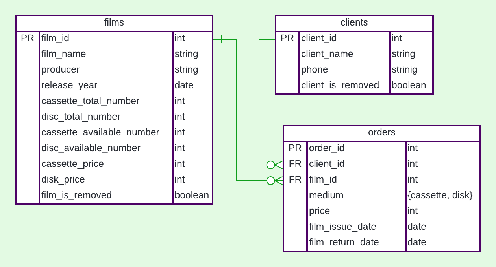

# web-server-java

[отчёт по первому этапу](./отчёт.md)

## How to run

1. Initialize postgres database.
   [Install Postgres](https://www.postgresql.org/download/linux/ubuntu/) first if not already installed

```shell
postgres@pc$ psql
postgres=# \i <path to project root>/SQLscripts/create_db_and_user.sql 
web_server_db=> \i <path to project root>/SQLscripts/tables_creation.sql
web_server_db=> \i <path to project root>/SQLscripts/tables_fill.sql 
```

2. Run docker container with the application

```shell
$ docker pull mariamsu/web-server-java:latest && 
  docker run --rm --net=host --detach --name web_server -e HOST="127.0.0.1" -e PORT=8080 mariamsu/web-server-java
```
To work with the application open the appropriate URL in a browser.

3. Kill the application

```shell
$ docker kill web_server
```

## How to build

1. Initialize postgres database (as in first step "How to run"). It requires for tests.

2. Build jar (this step also could be done using intellij IDEA)

```shell
web-server-java$ mvn -N io.takari:maven:wrapper  # setup maven wrapper
web-server-java$ mvn -Dtest=ServicesTest package  # build executable jar; [-Dtest=ServicesTest] to run only unit tests
```

3. *(Optional)* Run jar on specified address and port

```shell
web-server-java$ java -jar -Dserver.addres=localhost -Dserver.port=8080 ./out/artifacts/web_server_java_jar/web-server-java.jar
```

4. *(Optional)* Install `chromium-driver` and run system tests.
   The **application should be started** and listen on `localhost:8080`.

```shell
$ sudo apt-get install chromium-driver
$ mvn -Dtest=SystemTest test
```

5. Build & push docker image

```shell
$ export WEB_V="v1.1"
$ docker build --build-arg JAR_FILE=target/web-server-java-1.0.jar -t mariamsu/web-server-java:latest -t mariamsu/web-server-java:${WEB_V} .
$ docker push mariamsu/web-server-java:latest ; docker push mariamsu/web-server-java:${WEB_V}
```

## Architecture:
The project is built using **Maven** because 
there are more tutorials for Hibernate and Spring that use maven, then those that use **Ant**.

The database of this application consists of 3 tables:



There are POJO class, DAOInterface, DAOImplementation and service class for every table.

* **POJO** - Plain Old Java Object - class, whose fields corresponding to columns of the table and there is a getter and
  a setter for all columns. It is necessary for the storage objects of a table.
* **DAOInterface** - interface, that describes the calling necessary for the application. For example, such interfaces help to
  relatively painlessly change database (Postgre to lightSQL or something else, maybe noSQL)
* **DAOImplementation** - class, that implements communication with the database. 
  In this application DAOImplementation classes inherit GenericDAO_CRUD. 
  `GenericDAO_CRUD` ia a generic that implements basic methods for 
  Creating, Reading, Updating, Deleting objects in the database.
* **Service** - class, that implements business logic and calls DAO methods.


* **Controller** - class, that implements web user interface logic.
* **Web pages** are designed using [bootstrap](https://getbootstrap.com/).

There is `GenericDAO_CRUD class` that has templates for main create, read, update, delete methods of DAO classes.

## Notes

* **Service's methods** return `false` if something went wrong. It would be better to raise an exception with the error
  explanation (see "FailFast").
  
* I didn't understand the philosophy of **[hibernate](https://hibernate.org/)**. 
  It has a strange interface with a somewhat unexpected behaviour. 
  For example: 
  The method `session.delete(entity)` deletes the entity according only to entity's id,
  no matter which values other fields have. 
  The method `session.save(entity)` implicitly change `id` field of the saved object.
  And in my opinion hibernate severely limits flexibility of SQL, but gives little in return.
  The only advantage of hibernate that I have found is that 
  entities associated with the object by a foreign keys are automatically loaded 
  into the corresponding fields of the object.
  (For example in this application object `Order` automatically has corresponding `Film` and `Client` in class's fields)

* There are problems with **data consistency**. The information about `cassette_available_number`
  and `disc_available_number`
  is saved in the columns of `films` table. But it also could be obtained by counting unreturned orders in the `ordes` table.
  Thus we need to be careful when changing this data. I think it would be better to remove `...available_number`
  columns from database.

* There is no data consistency protection when the application is running in **parallel**.

* [Video](https://www.youtube.com/watch?v=H68EaWZvQtE) about an architecture of modern java web servers. 
  The main idea is that JSP (JavaServer Pages) is an outdated technology.
  
* I think it is wrong to **test** interaction of the application with the database (**services**)
  by using unit tests. But it was the simplest solution.
